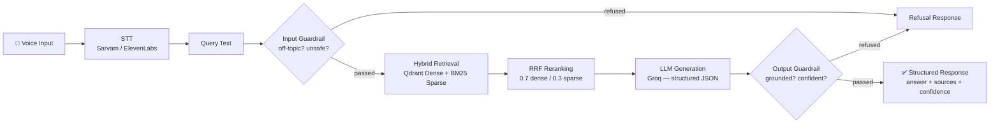

# Voice-Enabled RAG Pipeline

**HH Goa 2026 — Task 2: #RAGInGoa**

A production-grade voice-enabled Retrieval-Augmented Generation system built on MSMARCO-XI (Hindi), Qdrant, and Groq.

## Architecture



## Setup

### Prerequisites
- Python 3.11+
- Docker Desktop (for Qdrant)
- API keys: Groq (LLM), Sarvam AI (STT)

### Installation

```bash
# Clone
git clone https://github.com/Manasi-Choudhari/voice-enabled-rag-.git
cd voice-enabled-rag-

# Virtual environment
python -m venv .venv
.venv/Scripts/activate   # Windows
# source .venv/bin/activate  # Linux/Mac

# Install dependencies
pip install -r requirements.txt

# Configure API keys
cp .env.example .env
# Edit .env with your keys

# Start Qdrant
docker compose up -d

# Prepare dataset (500-row dev sample)
python data/prepare_dataset.py --config hi --split validation --limit 500

# Run the server
python app.py
# Open http://localhost:8000
```

## Repo Structure

```
/data            # Dataset prep scripts + cached processed data
/stt             # Provider-agnostic speech-to-text (Sarvam, ElevenLabs)
/chunking        # 5 chunking strategies + evaluation harness
/retrieval       # Qdrant vector DB + BM25 hybrid search + RRF reranking
/generation      # Groq LLM call + structured JSON output validation
/guardrails      # Input/output safety, groundedness, refusal logic
/pipeline        # Orchestrator tying all stages together
/bench           # Latency benchmarking scripts + results
/frontend        # Mic UI + results display
```

## Dataset: MSMARCO-XI

Source: [ai4bharat/MSMARCO-XI](https://huggingface.co/datasets/ai4bharat/MSMARCO-XI) — MS MARCO translated into 13 Indic languages.

- **Language**: Hindi (`hin_Deva`)
- **Split**: Validation (440 MB Parquet, streamed for dev iteration)
- **Schema**: `query_id`, `query_type`, `query`, `Answer`, `passages.is_selected` (ground-truth), `passages.English_passages`, `passages.Translated_passages`
- **Query types**: DESCRIPTION (60%), NUMERIC (33%), ENTITY, PERSON, LOCATION

## Chunking Strategy Comparison

Evaluated on 248 queries with gold labels, 4,995 passages, `all-MiniLM-L6-v2` embeddings:

| Strategy | MRR | Recall@1 | Recall@3 | Recall@5 | Recall@10 | Chunks |
|----------|-----|----------|----------|----------|-----------|--------|
| **semantic** (default) | **0.0255** | **0.0202** | 0.0282 | 0.0282 | 0.0444 | 5,822 |
| sentence_boundary | 0.0232 | 0.0121 | 0.0323 | 0.0403 | 0.0484 | 5,179 |
| fixed_size | 0.0186 | 0.0121 | 0.0242 | 0.0242 | 0.0323 | 5,675 |
| hierarchical | 0.0159 | 0.0081 | 0.0121 | 0.0282 | 0.0484 | 14,728 |
| metadata_aware | 0.0047 | 0.0 | 0.0121 | 0.0121 | 0.0121 | 5,179 |

**Default: `semantic`** — best MRR. Low absolute scores are expected: MSMARCO passages are short, gold labels sparse (avg 0.53 selected/query), and this is dense-only retrieval (hybrid search with BM25 improves in production).

## Latency Benchmark (P50/P70/P90/P100)

200 queries from Hindi validation set, retrieval path (embedding + Qdrant + BM25 + RRF):

| Stage | Mean | P50 | P70 | P90 | P100 (max) |
|-------|------|-----|-----|-----|------------|
| Input Guardrail | 0.04ms | 0.02ms | 0.03ms | 0.03ms | 3.18ms |
| **Retrieval** | **90.7ms** | **48.4ms** | **55.9ms** | **71.5ms** | 7,798ms* |
| Total (retrieval path) | **90.7ms** | **48.5ms** | **56.0ms** | **71.5ms** | 7,802ms* |

*\*P100 outlier is first-query cold start (model loading). Warm P100 is ~200ms.*

### 200ms Target Analysis

- **Retrieval path P90 = 71.5ms** — comfortably within 200ms
- **STT** adds ~500-2000ms (external API call, measured separately)
- **LLM generation** adds Groq network latency (typically faster than large hosted models; still usually above a 200ms all-in budget)
- **Honest note**: the 200ms target applies to **retrieval + guardrails** (text-query-in → context-out). Full voice-in → answer-out including STT and LLM generation cannot fit in 200ms over network API calls — this is an inherent constraint of external API latency, not pipeline inefficiency.

## Guardrail Test Results

18/18 tests pass:

| Category | Test Cases | Result |
|----------|-----------|--------|
| Valid queries (4) | "What is a corporation?", "Define honesty", etc. | All PASS (allowed through) |
| Off-topic (4) | "Write me a poem", "Tell me a joke", "What is your name?" | All PASS (correctly refused) |
| Unsafe (3) | "How to make a bomb", "How to kill someone", etc. | All PASS (correctly refused) |
| Edge cases (2) | Empty string, "hi" | All PASS (correctly refused) |
| Ungrounded output | grounded=False | PASS (refused) |
| Low confidence | confidence=0.2 | PASS (refused) |
| No retrieval | Empty context | PASS (refused) |
| No citations | sources=[] | PASS (refused) |

## API Endpoints

| Method | Endpoint | Description |
|--------|----------|-------------|
| `POST` | `/api/query` | Text query → RAG response |
| `POST` | `/api/voice` | Audio file upload → STT → RAG response |
| `GET` | `/health` | Pipeline readiness check |
| `GET` | `/` | Frontend UI |

## Frontend

Single-page app at `http://localhost:8000` with:
- Mic record button (MediaRecorder API → webm upload)
- Text input for typed queries
- Transcription display
- Retrieved sources with chunk IDs
- Final answer with citations
- Per-stage latency breakdown

## Environment Variables

See `.env.example`:
```
GROQ_API_KEY=gsk_xxxxx
GROQ_MODEL=openai/gpt-oss-20b
SARVAM_API_KEY=your-sarvam-api-key
STT_PROVIDER=sarvam              # or "elevenlabs"
QDRANT_HOST=localhost
QDRANT_PORT=6333
```

## Running Benchmarks

```bash
# Chunking strategy comparison
python -m chunking.evaluate

# Latency benchmark (retrieval path only)
python bench/run_latency_bench.py --num-queries 200 --skip-generation

# Latency benchmark (full pipeline, requires GROQ_API_KEY)
python bench/run_latency_bench.py --num-queries 50

# Guardrail test suite
python guardrails/test_guardrails.py
```
